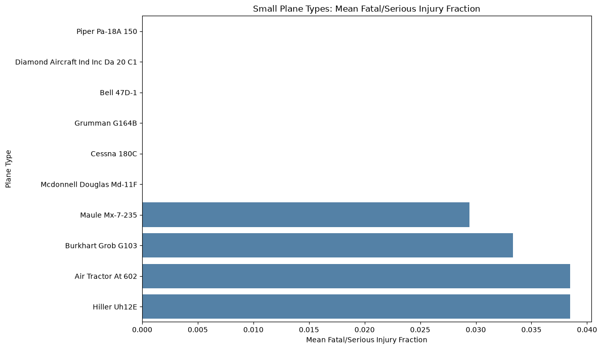
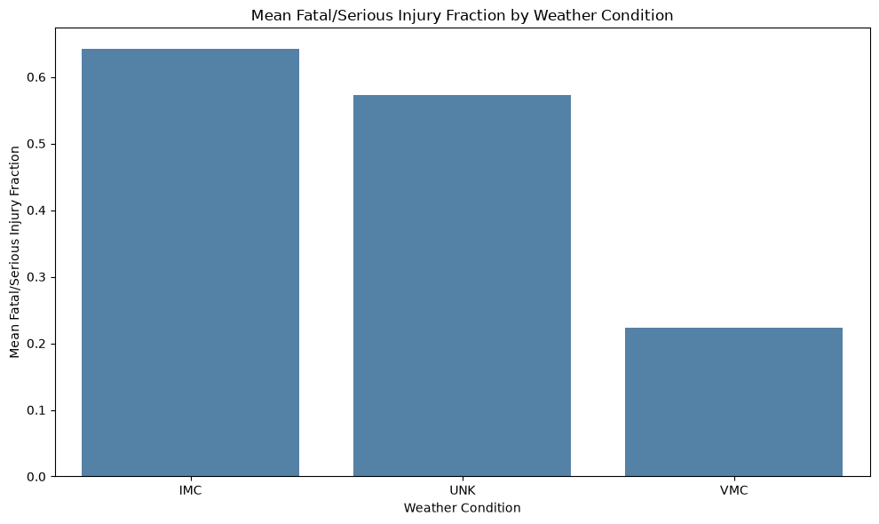
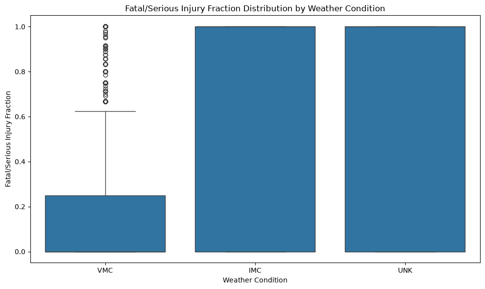
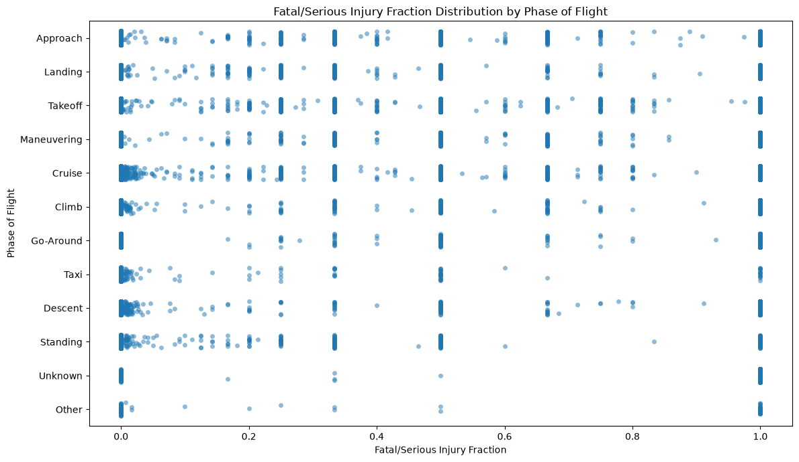
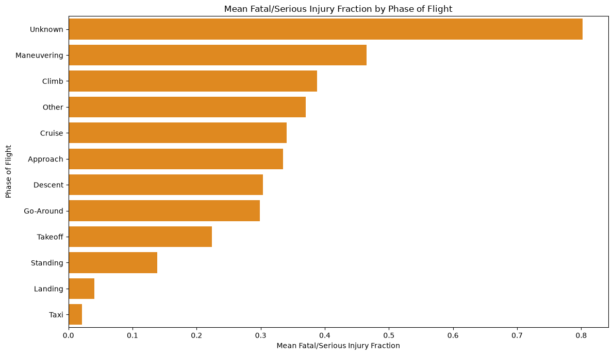

# Aviation Accident Analysis

This project analyzes aviation accident data to identify aircraft types and operating conditions associated with lower aircraft destruction rates and lower serious/fatal passenger injury fractions.

## Project summary

The analysis separates smaller aircraft from larger passenger models and focuses on meaningful safety indicators such as the fatal/serious injury fraction and destruction rate.

Key findings include:
- Some small aircraft types show lower average serious/fatal injury fractions than others when restricted to groups with enough observations.
- Poor weather conditions are associated with more severe accident outcomes.
- Certain phases of flight, especially maneuvering and climb, are associated with higher average injury severity.

## Key visualizations

### Small aircraft types with the lowest mean serious/fatal injury fractions

### Weather condition and injury severity

### Phase of flight and injury severity

## Files
- `Aviation_Accidents_Cleaning.ipynb` — cleaning notebook
- `Aviation_Accidents_Data_Analysis.ipynb` — analysis notebook
- `AviationData_cleaned.csv` — cleaned dataset
- `images/` — saved charts for the README

## Tools used
- Python
- Pandas
- Matplotlib
- Seaborn
- Jupyter Notebook

This repository contains an exploratory data analysis of aviation accident records, focused on identifying aircraft makes, plane types, and operating conditions associated with lower aircraft destruction rates and lower serious/fatal passenger injury fractions. The analysis uses a cleaned dataset covering accidents from 1983 onward and separates smaller aircraft from larger passenger models to support more relevant safety comparisons.

Project summary
The analysis indicates that accident severity varies meaningfully by aircraft group and operating context. For small aircraft makes filtered to at least 10 accidents, the lowest mean serious/fatal injury fractions in the current summary include Bombardier, Airbus Industrie, Bombardier Inc, Waco, and Grumman-Schweizer, though interpretation should still consider sample size and the distinction between make-level and model-level comparisons .

Weather condition and phase of flight both show strong relationships with accident severity. Instrument meteorological conditions (IMC) have higher average serious/fatal injury fractions and destruction rates than visual meteorological conditions (VMC), while maneuvering, climb, cruise, and approach show higher average injury fractions than less operationally demanding phases such as standing .

Key visualizations
Small aircraft makes with lowest mean serious/fatal injury fractions
This chart limits results to small aircraft and shows the 10 makes with the lowest mean serious/fatal injury fraction after keeping only makes with at least 10 accidents in the comparison set.

Weather condition and injury severity
Poor-weather conditions are associated with substantially higher mean serious/fatal injury fractions than visual conditions in the cleaned dataset.  

Phase of flight and injury severity
Accidents during maneuvering and climb appear more severe on average than several other phases of flight, reinforcing the importance of operational context in safety analysis.
 